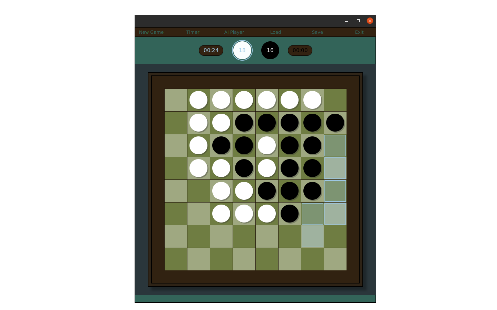

## This is Reversi game project for GUI lectures (in JavaFX).

### Project assumptions:

 * Easy to use UI
 * MVC design pattern

 ### Project features:
 
 * Timed Game (one click/double click -> on/off)
 * Load/Save state of game
 * Game summary
 * [TODO] AI Player module (based on MCTS)

  ### TODO:
  * Code refactoring

  1. Move styles to css file.
  2. Divide methods for smaller and more readable.
  3. Add sections to Controller (OnClickHandlers, HoverHandlers, searchMethods, flipMethods..)
  4. Rename some methods.

  * Web version

    https://github.com/yacotaco/Reversi-web
 